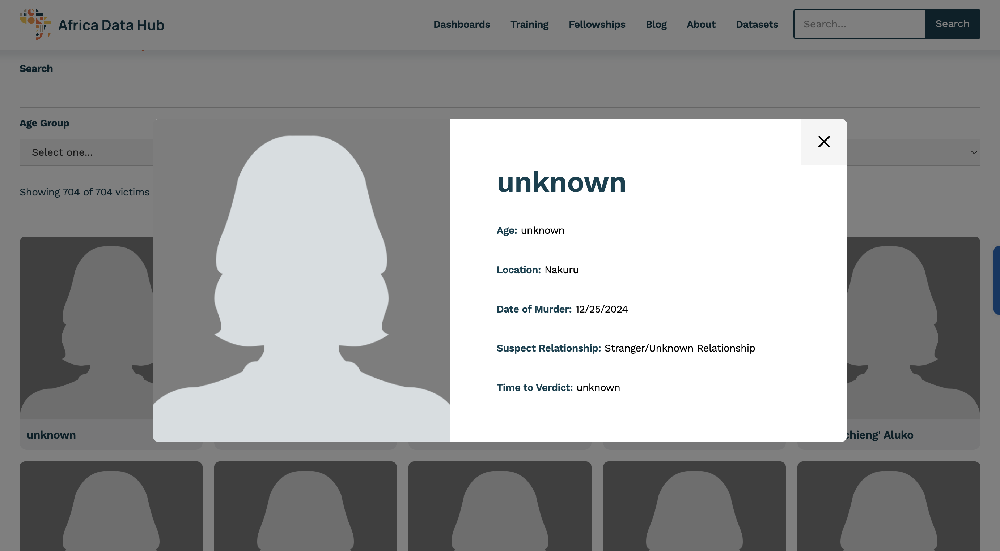
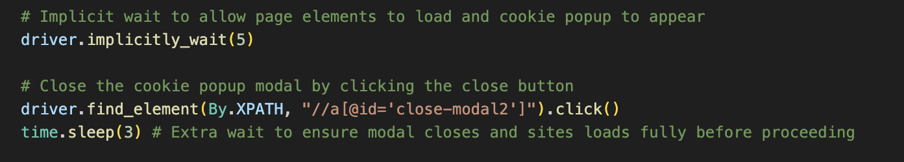
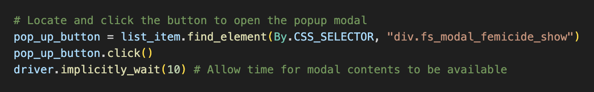
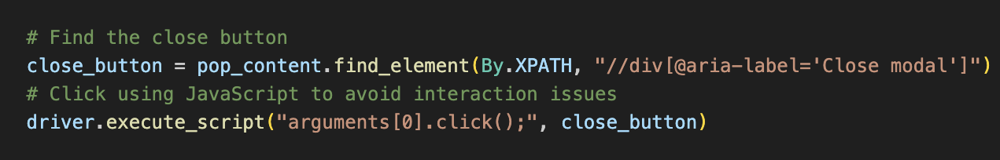
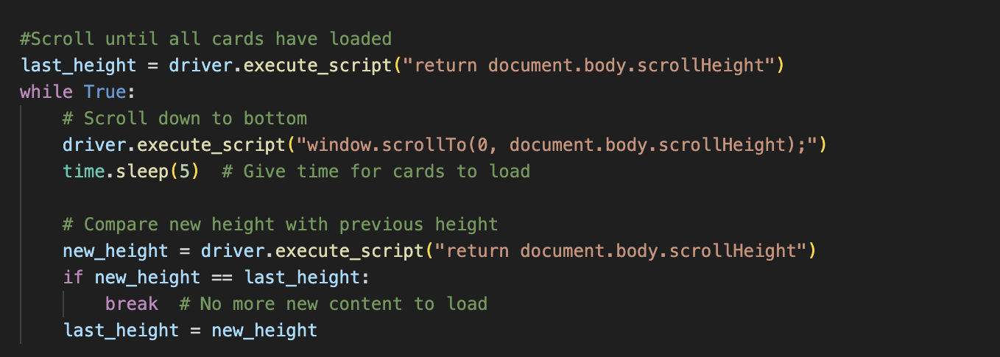
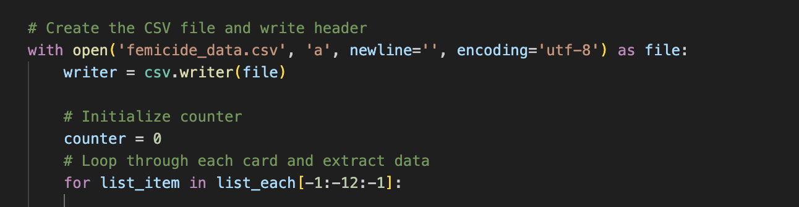
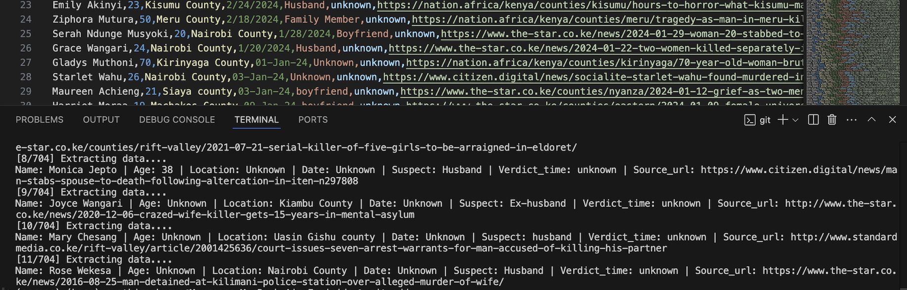

# Scraping and Analysing Femicide Data in Kenya (2016–2024)

## Outline

- [Introduction](#Introduction)
- [Tools and libraries](#Tools-and-libraries)
- [Scraping Logic](#Scraping-Logic)
- [Next Steps](#Next-Steps)
- [Future Improvements](#Future-Improvements)

## Introduction

Femicide has become a common term in news and social media, and I wanted to understand the scale of the issue through actual data. In searching for a reliable source, I came across an online repository by <a href="https://www.africadatahub.org/femicide-kenya">Africa Data Hub</a> that compiles femicide cases reported in Kenya.

The dataset includes over 700 cases of women killed between January 2016 and December 2024, drawn from verified news articles and court records. Each entry is linked to a source, adding transparency and credibility.

In this project I aim to extract, structure, and analyze the data to better understand patterns in the reported killings—who the victims were, where incidents happened, who the suspects were, and what outcomes followed. While the data may not be exhaustive, it provides a good starting point for discussing the scope and nature of femicide in Kenya.

## Tools and libraries

- **Selenium:** Used to automate browser interactions for scraping dynamic content from the target webpage.


- **Pandas:** Employed to structure, clean, and export the scraped data for analysis.


- **CSV:** Format used to store the cleaned dataset for further use and sharing.


- **Visual Studio Code (VS Code):** Main development environment for writing and debugging the scraping script.


- **Git:** Used for version control.


- **Python:** Primary programming language used to build the scraper and handle data processing.


- **ChromeDriver:** Bridge between Selenium and the Chrome browser, allowing automated control.

## Scraping Logic

Each record on the Africa Data Hub Femicide Database is presented in a **card-style** layout. However, these cards only display limited information by default. To access full details such as name, age, location, date, suspect, verdict time, and source article, a user must click on each card, which triggers a modal popup revealing this additional data.


To scrape all relevant information, I needed to replicate this interactive behaviour: 
- clicking each card
- extracting the content from the modal, and
- then closing it before moving to the next.

Due to the dynamic and interactive nature of the site, I selected Selenium for this task. Selenium allows for automated browser control, enabling interaction with JavaScript-rendered elements like modals and scrollable lists.

To implement this logic, I developed the following core scraping script:

```python
# Import libraries
from selenium import webdriver
from selenium.webdriver.common.by import By
from selenium.webdriver.support.ui import WebDriverWait
from selenium.webdriver.support import expected_conditions as EC
import time
import pandas as pd
import csv

# Initialize Chrome browser instance
driver = webdriver.Chrome()

# URL of the target femicide database page
website = 'https://www.africadatahub.org/femicide-kenya-database'
driver.get(website)

# Locate the container that holds all femicide cards
list_all = driver.find_element(By.CSS_SELECTOR, '#w-node-_33992fe6-30af-b0d1-21dc-3bff5128b970-2fedcb60')

# Get a list of individual card elements
list_each = list_all.find_elements(By.CSS_SELECTOR, "div[class='collection-item-7 w-dyn-item']")

# Initialize empty lists to store extracted information
names = []
locations = []
ages = []
dates = []
suspects = []
verdict_times = []
sources = []
counter = 0

# Loop through each card and extract data
for list_item in list_each:
    
    # Counter to track progress
    counter+=1
    print(f'[{counter}/{len(list_each)}] Extracting data....')

    # Locate and click the button to open the popup modal  
    pop_up_button = list_item.find_element(By.CSS_SELECTOR, "div.fs_modal_femicide_show")
    pop_up_button.click()
    
    # Get the modal content once it's opened
    pop_content = list_item.find_element(By.CSS_SELECTOR, "div[role='dialog']")
    
    # Extract and store Name
    names.append(pop_content.find_element(By.CSS_SELECTOR, "div[fs-cmsfilter-field='Name']").text)
    
    # Extract and store other victim details based on order
    details = pop_content.find_elements(By.CSS_SELECTOR, "div[class='text-block-47']")
    ages.append(details[0].text)
    locations.append(details[1].text)
    dates.append(details[2].text)
    suspects.append(details[3].text)
    verdict_times.append(details[4].text)
    
    # Extract and store the source URL
    sources.append(pop_content.find_element(By.TAG_NAME, "a").get_attribute("href"))

    time.sleep(0.5) # Pause before closing the modal

    # Find the close button 
    close_button = pop_content.find_element(By.XPATH, "//div[@aria-label='Close modal']")
    # Click using JavaScript to avoid interaction issues
    close_button.click()

    # Wait until the modal becomes invisible before proceeding
    WebDriverWait(driver, 20).until(EC.invisibility_of_element_located((By.CSS_SELECTOR, "div[role='dialog']")))

    # Print the extracted data for this entry
    print(f'Name: {names[-1]}|Age: {ages[-1]}|Location: {locations[-1]}|Date: {dates[-1]}| Suspect: {suspects[-1]}| Verdict_time: {verdict_times[-1]}| Source_url: {sources[-1]}')
    
    time.sleep(1) # Wait before moving to the next card

# Close Chrome driver session
driver.quit()
```

### Scraping Challenges Encountered and Solutions Implemented

Despite successfully interacting with the site in a browser, the initial version of the scraper was not producing the desired results. Several issues arose during implementation:

**1. Cookie Modal Obstruction:**

 The scraper failed to click on any of the victim cards initially. On inspection, this was due to the cookie consent modal overlapping the clickable elements.

 **Solution:** I introduced a command to locate and click the “Accept Cookies” button before attempting any other actions.
 

**2. Empty or Missing Data:**

Even after clicking the cards, some of the modal text fields we were trying to access were returning empty strings. This was due to the data not loading fast enough.

 **Solution:** I applied an implicit wait, allowing time for the modal text values to render before extraction.
 
 
**3.Unclickable Close Button:**

Attempting to close the modal using the standard `.click()` method raised a `ElementNotInteractableException`. This was because an invisible backdrop layer was overlapping the close button, making it visually present but unreachable to Selenium.

**Solution:** I enforced a JavaScript click using `driver.execute_script(...)`, which allows Selenium to directly trigger a DOM click, regardless of visual obstructions.


**4. Only 124 of 704 Records Extracted:**

Although the page showed 704 victims, the scraper was initially retrieving only 124 records. This suggested that not all card elements were being loaded at once.

**Solution:** I implemented a scrolling function to scroll to the bottom of the page repeatedly until no new cards were loaded. This ensured that all dynamic elements were visible in the DOM before scraping began.


**5. Scraping Halted at Record 691:**

After incorporating scrolling, the counter correctly identified 704 card slots. However, the process failed at record 691 due to an `ElementNotInteractableException.`.

Upon visual inspection of the webpage, I discovered that two of the card slots were empty. These caused Selenium to attempt interactions with elements that weren’t actually there.

**Solution:** I verified that only 690 valid records were written to the CSV, which aligned with expectations after subtracting the 2 empty slots.

To recover the remaining records (cards `692–702`), I devised a follow-up strategy:
- I adjusted the scraping loop to iterate from the last card backwards, limiting the run to the last 11 items.

- This secondary script used the same extraction logic and was designed to append new entries to the existing CSV file.



## Saving Extracted Data

Once data was successfully extracted from each modal, the next step was to store it in a structured format for further analysis.


To achieve this, I used Python’s `csv` and `pandas` libraries to:
- Create a new CSV file (`femicide_data.csv`)
- Define and write column headers (`Name`, `Age`, `Location`, `Date`, `Suspect`, `Verdict_time`, `Source_url`)
- Insert each record row-by-row within the main scraping loop

This setup ensured that even if the scraping was interrupted, each completed record was already saved to file.


### Appending Remaining Records

As mentioned earlier, the original run captured only 690 of the 702 valid records (due to two empty cards). To avoid rerunning the entire script and risking duplicated data:
- I modified the scraper to target the last 11 cards only
- The new script opened the existing CSV in append mode
- Extracted details were then written directly into the same CSV without overwriting existing content


## Final Script

Here is the final script I used for scraping:

```python
# Import libraries
from selenium import webdriver
from selenium.webdriver.common.by import By
from selenium.webdriver.support.ui import WebDriverWait
from selenium.webdriver.support import expected_conditions as EC
import time
import pandas as pd
import csv

# Initialize Chrome browser instance
driver = webdriver.Chrome()

# URL of the target femicide database page
website = 'https://www.africadatahub.org/femicide-kenya-database'
driver.get(website)

#Scroll until all cards have loaded
last_height = driver.execute_script("return document.body.scrollHeight")
while True:
    # Scroll down to bottom
    driver.execute_script("window.scrollTo(0, document.body.scrollHeight);")
    time.sleep(5)  # Give time for cards to load

    # Compare new height with previous height
    new_height = driver.execute_script("return document.body.scrollHeight")
    if new_height == last_height:
        break  # No more new content to load
    last_height = new_height

# Implicit wait to allow page elements to load and cookie popup to appear
driver.implicitly_wait(5)

# Close the cookie popup modal by clicking the close button
driver.find_element(By.XPATH, "//a[@id='close-modal2']").click()
time.sleep(3) # Extra wait to ensure modal closes and sites loads fully before proceeding

# Locate the container that holds all femicide cards
list_all = driver.find_element(By.CSS_SELECTOR, '#w-node-_33992fe6-30af-b0d1-21dc-3bff5128b970-2fedcb60')

# Get a list of individual card elements
list_each = list_all.find_elements(By.CSS_SELECTOR, "div[class='collection-item-7 w-dyn-item']")

# Create the CSV file and write header
with open('femicide_data.csv', 'a', newline='', encoding='utf-8') as file:
    writer = csv.writer(file)

    # Initialize counter
    counter = 0
    # Loop through each card and extract data
    for list_item in list_each[-1:-12:-1]:
        
        # Counter to track progress
        counter+=1
        print(f'[{counter}/{len(list_each)}] Extracting data....')

        # Locate and click the button to open the popup modal  
        pop_up_button = list_item.find_element(By.CSS_SELECTOR, "div.fs_modal_femicide_show")
        pop_up_button.click()
        driver.implicitly_wait(10) # Allow time for modal contents to be available
        
        # Get the modal content once it's opened
        pop_content = list_item.find_element(By.CSS_SELECTOR, "div[role='dialog']")
        
        # Extract and store Name
        name = pop_content.find_element(By.CSS_SELECTOR, "div[fs-cmsfilter-field='Name']").text
        
        # Extract and store other victim details based on order
        details = pop_content.find_elements(By.CSS_SELECTOR, "div[class='text-block-47']")
        age = details[0].text
        location = details[1].text
        date = details[2].text
        suspect = details[3].text
        verdict_time = details[4].text
        
        # Extract and store the source URL
        source = pop_content.find_element(By.TAG_NAME, "a").get_attribute("href")

        # Write to CSV immediately
        writer.writerow([name, age, location, date, suspect, verdict_time, source])

        time.sleep(0.5) # Pause before closing the modal

        # Find the close button 
        close_button = pop_content.find_element(By.XPATH, "//div[@aria-label='Close modal']")
        # Click using JavaScript to avoid interaction issues
        driver.execute_script("arguments[0].click();", close_button)

        # Wait until the modal becomes invisible before proceeding
        WebDriverWait(driver, 20).until(EC.invisibility_of_element_located((By.CSS_SELECTOR, "div[role='dialog']")))

        # Print the extracted data for this entry
        print(f'Name: {name} | Age: {age} | Location: {location} | Date: {date} | Suspect: {suspect} | Verdict_time: {verdict_time} | Source_url: {source}')
        
        time.sleep(1) # Wait before moving to the next card

# Close Chrome driver session
driver.quit()
```
## Next Steps

With the raw data successfully scraped and stored in a structured CSV format, the following steps are planned to complete the project pipeline:

- **Load the CSV data** into a pandas DataFrame for further manipulation
- **Clean the dataset** to handle any missing values, inconsistent entries, or formatting issues
- Perform high-level **Exploratory Data Analysis (EDA)** to uncover trends, common patterns, and demographic insights to better understand the scale and nature of femicide cases in Kenya
- Import the cleaned data into a **visualization tool** (e.g., Power BI or Tableau) to create an interactive dashboard for clearer presentation and easier interpretation

These next steps will transform the raw scraped data into meaningful insights and help communicate findings in a more accessible and compelling way.


## Future Improvements

While the current project accomplishes its primary goal of extracting structured femicide data, there are several areas for enhancement to increase robustness, maintainability, and automation:
- **Code Modularity:** Break the scraper into smaller, reusable functions and possibly wrap it into a class structure to improve readability and facilitate debugging or testing.
- **Error Handling:** Introduce structured try-except blocks to handle common scraping issues like element not found, stale references, timeouts, or click interceptions—preventing unexpected crashes during execution.
- **Automated Updates:** Develop a scheduled pipeline using tools like cron, Windows Task Scheduler, or Airflow to re-run the scraper periodically and check for new records on the site. (Delta Extraction).
- **Data Validation:** Add checks to ensure that extracted fields follow expected formats (e.g., dates, names), and flag or log anomalies.
- **Logging System:** Implement logging (e.g., with Python’s logging module) to track scraping progress, errors, and performance metrics over time.
- **Headless Browser Optimization:** Use headless mode in production environments to reduce resource usage, while retaining the option for full browser mode during debugging.
- **Cloud Deployment:** Host the scraper on a cloud function (e.g., AWS Lambda, Google Cloud Functions) or containerize it using Docker for scalability and portability.
