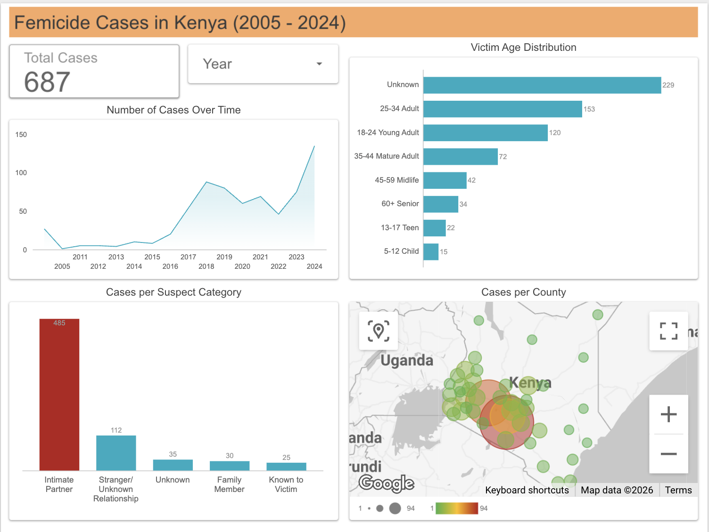

# Scraping and Analyzing Femicide Data in Kenya (2016–2024)

A data project combining web scraping, data cleaning, and analysis of publicly available femicide records from the Africa Data Hub. The project extracts over 700 records of reported female killings in Kenya between 2016 and 2024, structures the data, and analyzes patterns to understand the scale and nature of gender-based violence in Kenya.

## Project Overview

- **Objective:** Automatically extract detailed femicide records from a card-based, interactive website, clean and structure the data, and analyze patterns in reported cases.
- **Motivation:** With increasing public discussion around femicide in Kenya, I wanted to move beyond headlines and explore the actual data to uncover patterns in who is affected, where incidents occur, and who the perpetrators are.
- **Outcome:** A cleaned, structured dataset containing 687 femicide records with comprehensive analysis revealing temporal trends, age distribution, geographic patterns, and perpetrator relationships. Key findings visualized in an interactive Looker Studio dashboard.

## Tools and Libraries
- **Python –** Programming language
- **Selenium –** Browser automation for dynamic web scraping
- **Pandas –** Data manipulation, cleaning, and analysis
- **CSV module –** Appending records in real time
- **VS Code –** Code editor used during development
- **Git & GitHub –** Version control and project hosting
- **Looker Studio –** Interactive dashboard and visualization

## Project Workflow

### 1. Data Collection (Web Scraping)

Each femicide record on the source website is presented as a clickable card. Clicking opens a modal with detailed information such as the victim’s name, age, location, and source article.

Due to this dynamic structure, Selenium was the appropriate tool to simulate these interactions and extract data.

**The scraper:**
1. Loads the site and closes the cookie modal.
2. Scrolls to the bottom to ensure all records are loaded.
3. Iteratively clicks each card, extracts data from the modal, and closes it.
4. Writes each extracted record to a CSV file immediately.

**Key challenges addressed:**
- Cookie modal obstruction
- Lazy-loaded content requiring scrolling
- Element interaction issues requiring JavaScript clicks
- Empty card slots causing scraping failures
- Handling 702 records split across two scraping runs

### 2. Data Cleaning & Preparation
Comprehensive data quality assessment and cleaning was performed to ensure analytical reliability:

**Completeness analysis:**
- Age: 33% unknown
- Location: 8.7% unknown
- Date: 3.9% unknown
- Suspect: 5% unknown
- Verdict_time: 92% unknown (flagged as low reliability)

**Data Cleaning & Transformation:**
- Converted all "unknown" variants to consistent missing value handling ('Unknown' for text columns and 'Nan' for numerical columns)
- Standardized location names, corrected spelling inconsistencies (e.g., "Taita Tavet" → "Taita Taveta")
- Parsed multiple date formats into standard datetime
- Cleaned and categorized suspect relationships into meaningful groups (Intimate Partner, Family Member, Known to Victim, Stranger/Unknown Relationship)
- Created age groups for demographic analysis (Child, Teen, Young Adult, Adult, etc.)
- Extracted temporal features (Year, Month, YearMonth) for trend analysis
- Built a composite victim key for deduplication
- Identified and resolved duplicate records where victim details matched but suspect information conflicted across news sources

**Final dataset:** 687 unique, cleaned records ready for analysis

### 3. Visualization & Analysis
An interactive dashboard was built in Looker Studio, presenting:
> **🔗 [View Interactive Dashboard](https://lookerstudio.google.com/reporting/b7843c54-8869-424c-81a1-8d6f50d0b3c8))**

- Total case count and temporal trends over time
- Age distribution across life stages
- Geographic distribution via county-level map
- Perpetrator category breakdown
- Year filter for temporal analysis

### 4. Key Findings
**Temporal Patterns:**
Persistent upward trend through 2024, indicating ongoing crisis
Cases peaked in 2024 with 135 cases, suggesting femicide remains a critical concern

**Victim Demographics:**
25-34 year-olds are the most affected age group (153 cases, 22% of total)
18-24 year-olds are the second highest (120 cases, 17% of total)
Vulnerable populations include 22 teens (13-17 years), 15 children (5-12 years), and 34 cases involving senior citizens (60+)

**Geographic Distribution:**
Nairobi, Nakuru, and Kiambu Counties have significantly higher case concentrations
County-level disparities reveal uneven geographic risk

**Perpetrator Analysis:**
71% of cases involve intimate partners (485 out of 687 cases) including husbands, ex-husbands, boyfriends, ex-boyfriends, and lovers

**Justice System Gaps:**
Verdict/outcome data severely limited, with 92% of cases having unknown justice outcomes
This highlights a weakness in case tracking and follow-through within the justice system

### 5. Recommendations & Impact
**Policy & Programming:**

Prioritize intimate partner violence prevention programs given 71% of perpetrators are intimate partners
Target interventions toward women aged 18-34 who face highest risk
Focus resources on high-burden counties, particularly Nairobi, Nakuru & Kiambu
Strengthen data collection protocols to reduce verdict tracking gaps

**Advocacy:**
Use findings and data to support evidence-based campaigns on gender-based violence
Highlight the intimate partner violence crisis with concrete data
Advocate for improved justice system tracking and case outcome reporting

**Future Research:**
Investigate factors driving intimate partner violence (economic stress, substance abuse, relationship dynamics)
Analyze seasonal patterns or policy change impacts on case trends
Integrate additional data sources (economic indicators, legal reforms) for deeper insights
Conduct a comparative analysis across high vs low burdened counties

### 6. Project Impact

- Provides a high-level, comprehensive, structured view of femicide patterns in Kenya
- Enables geographic and demographic targeting for intervention programs
- Identifies critical data gaps requiring attention (verdict tracking)
- Supports evidence-based policy dialogue on gender-based violence prevention

## Project Structure

- `scrape/` - Virtual environment folder (not tracked in Git)
- `.gitignore` - Ignores venv, cache, and other unnecessary files
- `femicide_data.csv` - Raw scraped data (701 records)
- `Femicide-data-extraction-report.md` - Detailed scraping documentation
- `requirements.txt` - All dependencies used (e.g. selenium, pandas)
- `scraper.py` - Original scraper script for records 0–690
- `scraper2.py` - Second script to append last 11 records (691–701)
- `README.md` - Project overview and usage instructions
- `Femicide_analysis.ipynb` -Jupyter notebook with data preparation and cleaning process
- `femicide_clean.csv` - Cleaned, analysis-ready data (687 records)

📎 Source

All data is sourced from the publicly available <a href="https://www.africadatahub.org/femicide-kenya">Africa Data Hub</a>, compiled from news reports and court records between 2016 and 2024.

